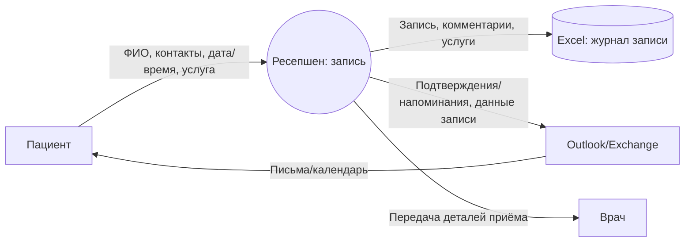
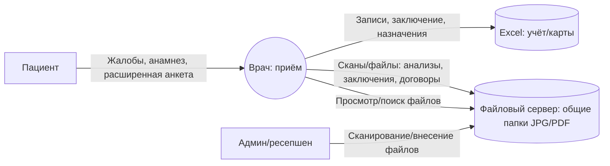

# 2) Data Flow Diagrams (DFD) — As‑Is

Ниже — DFD текущего состояния. Для каждого процесса дана отдельная диаграмма.

Обозначения:
- **External Entity** — внешний актор/система.
- **Process** — процесс обработки данных.
- **Data Store** — хранилище данных.
- Стрелки — потоки данных (что именно передаётся).

## DFD‑A1. Запись пациента на приём (через ресепшен, вручную)



**Ключевые данные:** PII, данные расписания, иногда медицинские данные (жалобы/причина обращения) в комментариях.

## DFD‑A2. Приём и ведение медицинской карты (файлы/сканы на общем диске)



**Ключевые данные:** спецкатегории ПДн/медтайна + PII; часто неструктурировано.

## DFD‑A3. Результаты анализов (взаимодействие с лабораторией без формализованного API)

```mermaid
flowchart LR
  L[Лаборатория] -->|Результаты (PDF/JPG), иногда в письме| M[Outlook/Exchange]
  M -->|Вложения| A((Админ/ресепшен: получение))
  A -->|Сохранение вложений| F[(Файловый сервер: общие папки)]
  D[Врач] -->|Запрос результатов| A
  A -->|Ссылка/файл| D
```

**Ключевые данные:** медицинские данные + PII. Потоки часто проходят через почту и общий диск.

## DFD‑A4. Оплата услуг, 1С и ККМ

```mermaid
flowchart LR
  P[Пациент] -->|Оплата, реквизиты (минимально)| C((Кассир: приём оплаты))
  C -->|Факт оплаты (ручной учёт)| X[(Excel: оплаты/реестры)]
  C -->|Проводки, документы| B[(1С:Бухгалтерия (файловый режим))]
  B -->|Фискализация/чек| K[ККМ]
  K -->|Статусы/данные чека| B
```

**Ключевые данные:** финансы + PII в документах/чеках/договорах; дублирование в Excel.

## DFD‑A5. Учёт ТМЦ и интеграция 1С (склад ↔ бухгалтерия)

```mermaid
flowchart LR
  S((Склад: учёт ТМЦ)) -->|Приход/расход, накладные| W[(1С:Торговля и склад (файловый режим))]
  W -->|Интеграция данных учёта| B[(1С:Бухгалтерия)]
  B -->|Сверка/отчётность| ACC[Бухгалтерия]
```

**Ключевые данные:** преимущественно операционные; но документы могут содержать ПДн (ответственные лица, подписи).

## DFD‑A6. Хранение и обмен файлами внутри офиса (общий диск как «шина»)

```mermaid
flowchart LR
  U[Сотрудник (AD-учётка)] -->|Чтение/запись/копирование| F[(Файловый сервер: общие папки)]
  U -->|Отправка файлов| M[Outlook/Exchange]
  M -->|Вложения| U2[Другой сотрудник]
  U2 -->|Сохранение вложений| F
```

**Ключевые данные:** любые (PII/медданные/договоры) могут циркулировать без классификации и контроля.

## Примечание по границам доверия (As‑Is)

- Фактически вся внутренняя сеть/сервер в офисе — **единая зона доверия**.
- Контроль доступа — в основном «доступ к папке/учётке», а не «доступ к данным».
- Нет формальных API/контрактов и механизмов ограничения раскрытия по категориям данных.
